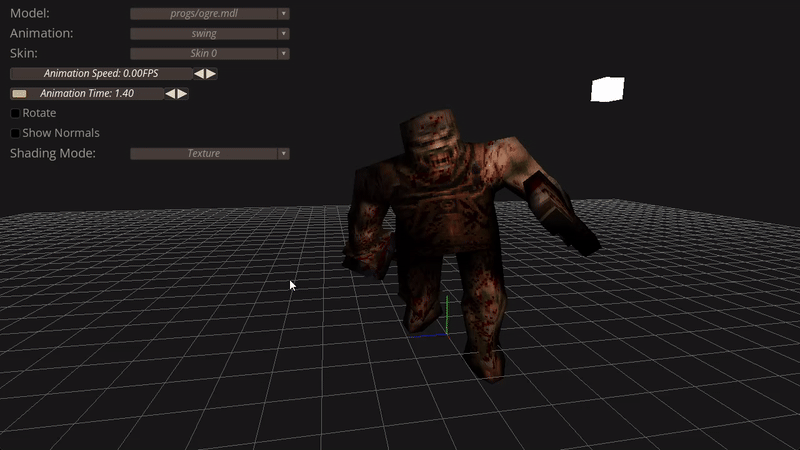

# quake-mdl-viewer

a MDL and MD2 viewer for Quake and Quake 2 models.

## Quick Start

```jai
jai build.jai
```

## Features

- Read .pak files and find MDL or MD2 models to load.
- Drag & Drop support.
- Select animation for playback.
- Control animation speed / timer.
- Smooth frame by frame interpolation.
- Select between multiple shading modes.
- Dynamic camera.
- Skin selection.
- Render normals.
- Skybox.
- Quake-style dropdown console.
- Translation, Rotation and Scaling gizmos.

|     |     |
| --- | --- |
|  Drag and Drop support |  Animation playback control |
|  Dynamic Camera |  Render normals |
|  Select shading mode |  Skin selection |
|  Select animation |  Quake-style Console |
|  Skybox support |  Translate, Rotate & Scale Gizmos |


## Resources

This is a project I created for learning purposes, to learn about Quake, rendering and the jai programming language.

- <http://tfc.duke.free.fr/coding/mdl-specs-en.html>
- <https://gist.github.com/mmozeiko/77fd5cd64a0c7e7bf3f1bc6923af786e>
- <http://tfc.duke.free.fr/coding/src/mdl.c>
